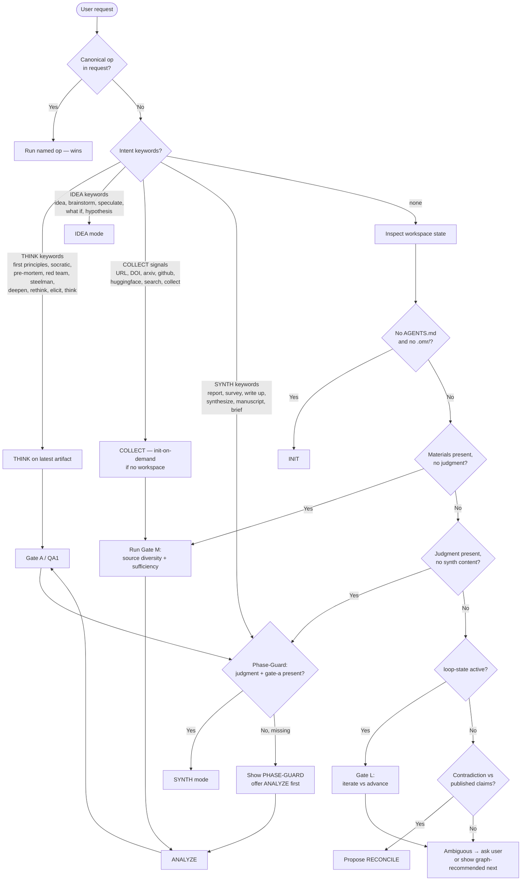

# Oh-My-Research

Intelligent orchestrator for **report-first deep research**. Auto-detects user intent and workspace state, then executes the right mode — initialize, collect materials, deep-analyze with evidence boundaries and thinking paradigms, synthesize a survey/report, or maintain state.

**North star:** high-quality deep research reports from collected materials and evidence — not prototypes, not coding validation.

## When to Use This Skill

- **Start** a research workspace on a topic
- **Collect** papers, URLs, repos, datasets
- **Analyze** materials into evidence maps and judgments
- **Deepen** analysis with first principles, Socratic, triangulation, etc. (THINK)
- **Write** a survey, report, manuscript, or brief
- **Reconcile** when new evidence contradicts prior claims
- **Run** the full Evidence-Deep workflow

**Keywords**: research, survey, literature review, evidence, collect papers, analyze, first principles, synthesize report, deep research, oh-my-research, omr

## Core Pipeline (Evidence-Deep)

```
COLLECT materials → [Gate M] → ANALYZE (deep evidence + THINK) → [Gate A] → [Gate P] → SYNTH (survey / report)
```

Optional: IDEA, DECIDE (stance), RECONCILE. Default pattern: **Evidence-Deep**. See `references/GRAPH.md` and `patterns/`.

## Auto-Detection Decision Tree

The agent runs **intention detection first**, then falls back to **workspace-state detection**. Canonical op names (`init`, `collect`, `analyze`, `think`, `synth`, `decide`, `idea`, `reconcile`, `workflow`, `qa`) **always win** over keyword routing.



**Always show a phase label** at the start of each action: `[INIT]`, `[COLLECT]`, `[ANALYZE]`, `[THINK]`, `[SYNTH]`, `[RECONCILE]`, `[FINISHED]` (plus `[DECIDE]` / `[IDEA]` when used).

## Phase-Guard: Cross-Stage Jump Protection

Before routing to a stage, **read `.omr/tree-state.json`** and check whether the target stage is `unlocked`, `ready`, or `completed`. If `locked`, verify the required **prerequisite artifacts** exist on disk before proceeding. This prevents silent stage-skipping (e.g. user says "write report" → SYNTH keyword detected → but no `judgment-*.md` exists).

| Target stage | Required prerequisite artifacts | Required gate JSON | If missing |
|---|---|---|---|
| ANALYZE | `materials/` with ≥1 source + `docs/index/` entry | `gate-m.json` (source diversity + sufficiency, run during ANALYZE) | Route to COLLECT first |
| THINK | `docs/plans/judgment-*.md` or `docs/plans/evidence-*.md` | (none) | Route to ANALYZE first |
| SYNTH | `docs/plans/judgment-*.md` | `gate-a.json` (pass) + `gate-p.json` | Route to ANALYZE → THINK → Gate A → Gate P first |
| DECIDE | `docs/plans/judgment-*.md` | (none) | Route to ANALYZE first |

**Blocking by default.** The agent must not proceed past a missing prerequisite without either (a) satisfying the prerequisites or (b) receiving an explicit user override (e.g. "I know, just write the report" or "skip guard"). A general instruction like "write the report" does **not** count as an override. When overridden, record `scenario_note: "prerequisite skipped by user override"` in the next gate JSON for auditability.

**Tree-state staleness:** after every op, update `.omr/tree-state.json` — move completed stages to `completed`, unlock dependents, write a brief `notes` summary. A stale tree-state signals an interrupted workflow; check and refresh it at the start of any new op.

## Operation Modes

| Mode | Op | One-line | Detail |
|------|----|----------|--------|
| INIT | `init "<topic>"` | Bootstrap workspace (only `AGENTS.md` + `.omr/*.json`; no empty folders) | `references/INIT/init.md` |
| COLLECT | `collect <url\|query\|…>` | Sources → materials + indexes + **full-text Markdown** (via anydoc) | `references/COLLECT/collect.md` |
| ANALYZE | `analyze` | Brief, evidence-map, judgment; reads full-text Markdown; Gate M before, Gate A / QA1 after, Gate T after THINK | `references/ANALYZE/analyze.md` |
| THINK | `think [method]` | Methodology-driven elicitation on research artifacts (never code); stamps `hardened`/`refined`/`unchanged`/`killed` | `references/THINK/think.md`, `references/THINK/methods/` |
| SYNTH | `synth [--mode] [--format docx\|pdf] [--language] [--resume] [--chapter] [--no-wiki]` | Incremental long reports in preferred language; Gate P confirms prefs; never one-shot a deep report | `references/SYNTH/synth.md`, `references/SYNTH/long-report.md`, `references/LANGUAGE.md` |
| IDEA | `idea "…"` | Capture speculative notes (optional) | `references/IDEA/idea.md` |
| DECIDE | `decide` | Stance / claim framing with ≥3 alternatives; Gate B (optional) | `references/DECIDE/decide.md` |
| RECONCILE | `reconcile` | Contradiction blast-radius, archive, rollback | `references/RECONCILE/reconcile.md` |
| VERSION | — | Workspace artifact versioning: tag, history, diff, backup, list | `references/VERSION/version.md` |
| WORKFLOW | `workflow [--pattern P]` | Graph-driven multi-step Evidence-Deep (or other pattern) | `references/WORKFLOW/workflow-overview.md` |
| QA | `qa qa1\|qa2\|all\|state-check` | LLM QA checklists; `state-check` reconciles disk vs tree-state | `references/GATES.md` |

## Confirmation Gates

Default **semi-automated** (pause for confirm). Support "no confirmations" / quick-pass. Rapid pattern skips all gates (fully-automated).

| Gate | When |
|------|------|
| M | After COLLECT: source diversity & enough materials? Shows diversity report, asks user: collect more types or proceed? |
| L | Loop pattern: iterate vs advance |
| A / QA1 | After ANALYZE judgment, before unlock SYNTH |
| T | After THINK: collect more from surfaced gaps? |
| B | Only if DECIDE runs |
| P | Before SYNTH: language / format / mode / audience |
| Lenses | Structure → Prose → Adversarial before Gate D |
| D / QA2 | Before publishing SYNTH |

**Post-Step Routing Menu** (after Gate M / IDEA / Gate A / THINK proceed / Gate T / Gate B): (1) Pause at each gate (default) · (2) Quick pass · (3) Continue recommended (next graph edge) · (4) Run THINK · (5) Switch pattern · (6) Stop.

## Default Paths

Paths below are **logical destinations**. Create a folder only when writing the first file into it (see `references/INIT/init.md`).

| Artifact | Path (when content exists) |
|----------|------|
| State | `.omr/` (tree-state, pattern, locale; other JSON as needed) |
| Materials | `materials/{papers,web,github,datasets,search,failed}/` — only buckets that receive files |
| Indexes | `docs/index/` |
| Plans | `docs/plans/` |
| Ideas | `docs/ideas/` |
| Reports | `docs/{survey,report,manuscript,brief}/` |
| Wiki | `wiki/` |
| Archive | `docs/archive/` |

Templates: `assets/`. Patterns: `patterns/`. Full operation reference: `references/REFERENCE.md`.

## Best Practices

1. Trust auto-detection; override with canonical ops when needed
2. **Phase-Guard before every stage (blocking by default)** — read `.omr/tree-state.json`, check prerequisites, show `[PHASE-GUARD]` if missing; never silently skip a stage
3. Never create empty directories — mkdir only as the parent of a real file write
4. Never upgrade `suggests` → `proven` without stronger source language
5. Use THINK (first principles / triangulation) before Gate A when confidence is low — in Evidence-Deep, THINK is offered by default after judgment, not only when confidence is low
6. **Run Gate M after every collect batch** — show the source-type diversity report (papers, web, github, datasets, models), let the user decide whether to collect more source types before proceeding to analyze. Prevents premature analysis on narrow or single-type corpora
7. Write long reports chapter-by-chapter to disk; keep a pruned continuity brief; author `.omr/report-state.json` to match the topic outline; resume if interrupted
8. Prefer a professionally formatted DOCX or PDF in the preferred language (timezone/locale auto-detect via `LANGUAGE.md` / `.omr/locale.json`, or explicit `--language`); drive its presentation via an LLM-authored `_document.json` (title, fonts, cover, TOC, header/footer, chapter order) rather than script defaults
9. Keep internal traceability private; translate it into standard citations and natural prose
10. Make the final report self-contained, professional, and accessible to its intended reader
11. Run LLM QA checklists (adapt thresholds to the scenario); write results under `.omr/quality-gates/`
12. Write full reports to disk; reply in chat with summary only
13. Run document lenses and visually inspect the rendered file before Gate D
14. **Update `.omr/tree-state.json` after every op** — move completed stages to `completed`, unlock next stages; never leave tree-state stale

## Dependencies

- Read/write project workspace
- Agent-authored state under `.omr/` (tree, loop, report-state, quality-gates) — see `references/LLM-STATE.md`
- Mechanical scripts only: `export_report.py` (thin, spec-driven DOCX/PDF renderer applying LLM-authored `_document.json`), `prefer_language.py` (timezone/locale → BCP-47 language tag), `version_control.py` (workspace tags/backups), `collect_cli.py` (records source + invokes `material_to_markdown.py` to download + convert to full-text Markdown), `material_to_markdown.py` (downloads source via arxiv/DOI/URL, converts to Markdown via **anydoc** with pymupdf/pdfplumber/markdownify fallbacks; supports `--convert-dir` for batch conversion of pre-downloaded files), `report_lint.py` (publication-safety linter: scans report chapters for leaked internal IDs, evidence-grade labels, workflow jargon, gate names, and private paths)
- `python-docx` / `reportlab` via `scripts/requirements.txt` for export; **anydoc** (`npx -y @firecrawl/anydoc`, Node 20+) for material → Markdown conversion; optional `pymupdf` / `pdfplumber` / `markdownify` / `beautifulsoup4` as fallbacks if anydoc is unavailable

## Deep Dive

- `references/REFERENCE.md` — complete operation guide, artifact naming, evidence boundaries, tree state, troubleshooting
- `references/GRAPH.md` — pattern graphs, node ↔ artifact contracts, unlock rules, cycles
- `references/GATES.md` — gate definitions and QA checklists
- `references/LLM-STATE.md` — agent-owned state JSON schemas
- `references/LANGUAGE.md` — timezone/locale → preferred BCP-47 language tag
- `references/THINK/methods/` — per-method elicitation playbooks
